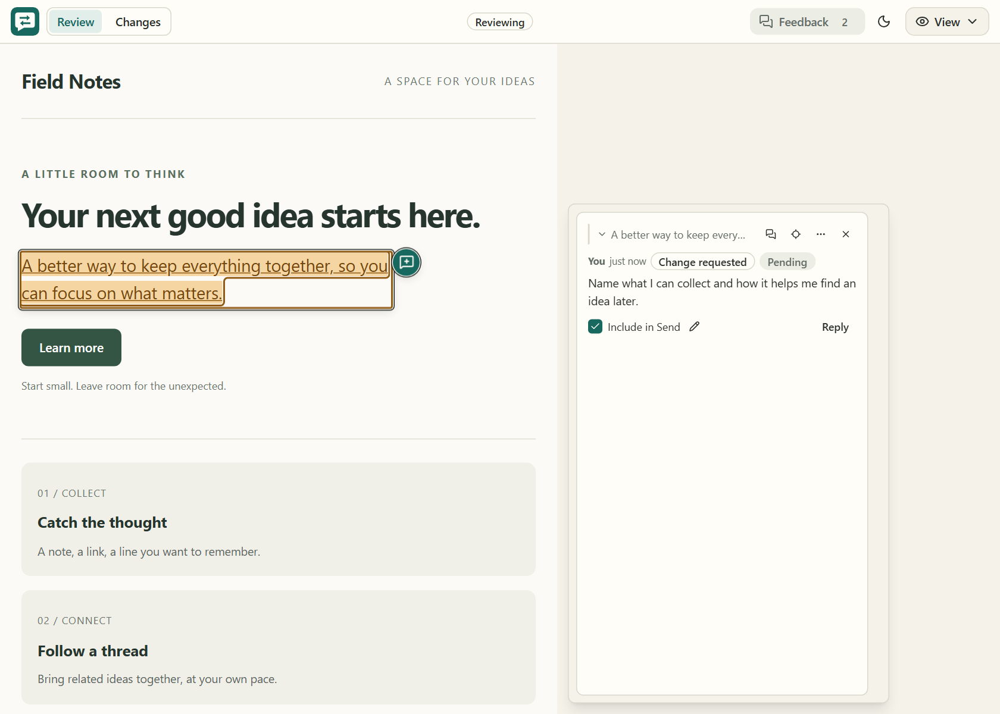

# Doc Review

Review HTML, Markdown, and localhost pages, edit when you choose, leave contextual comments, and send all feedback to your AI agent at once.

[Read the original Human Review launch post](https://creatoreconomy.so/p/use-my-human-review-skill-to-edit-html-markdown-visually)

https://github.com/user-attachments/assets/7cab09c9-eaa0-4e8b-984d-2925e810b5c2

## Problem

Giving AI feedback on files in chat is painful.

Sometimes you want to change one sentence yourself. Instead, you end up typing:

> In the third paragraph, change X to Y. Cut the third card because it repeats the first one. Also rewrite the CTA.

Then the agent changes the file and you have to check whether it understood every instruction. This gets even harder when you’re reviewing a long plan, Markdown document, landing page, or multi-page website.

## How to install /doc-review

The easiest way to install the skill is to paste this into ChatGPT, Claude Code, Codex, or your favorite coding agent:

```text
Install the /doc-review skill globally from https://github.com/erdemtuna/doc-review
```

You can also install it with `npx`:

```sh
npx -y @erdemtuna/doc-review setup --global
```

This fork uses the `doc-review` command, `/doc-review` skill, and
`~/.doc-review` state directory. It does not install a `human-review` alias or
migrate upstream state and skill files; remove those old files manually if you
no longer need them.

## How to use /doc-review

Review is opt-in: explicitly invoke `/doc-review` or ask to open an interactive
browser review. Writing, updating, or asking for a general review of content does
not automatically open the browser or start polling. An explicitly started review
continues until you end it or switch tasks.

After updating installed skill instructions, start a fresh agent session or reload
skills (in Copilot CLI, `/skills reload`). Setup copies the executing package's
skill template; rerunning setup from an older package can restore older behavior.
Setup updates its own `AGENTS.md` guidance inside `<!-- BEGIN doc-review -->` and
`<!-- END doc-review -->` markers. Exact, known older generated blocks are migrated.
Custom guidance is preserved with a migration message rather than overwritten;
update it yourself if it requests automatic review. Invalid or duplicate markers
must be corrected before setup can proceed.



Open an HTML or Markdown file:

```text
/doc-review (your file)
```

Review a page running on localhost:

```text
/doc-review (localhost URL)
```

Doc Review opens in **Review**, with **View** selected, so you can read, use page controls, and comment. Switch to **Edit** to change content directly. Plain HTML saves edits to the file; scripted HTML, Markdown, and localhost pages send edits to your agent. Commenting stays available in both modes.

Select text, or hover or focus an element, then use the nearby comment icon. `Ctrl+Alt+M` (`Cmd+Option+M` on macOS) opens a comment for the current selection. Press Enter to submit or Shift+Enter for a new line. On desktop the composer stays beside its target, or pins to the effective top or bottom scrolling edge when that target leaves view. **Back to selection** reveals the target without changing the draft. The full-width sheet is used only at the narrow responsive breakpoint.

**Comments** is the single toolbar entry point for the closed-by-default review drawer. Its feedback inventory scrolls independently while the overall note and **Send to agent** controls remain fixed. Submitting a comment creates its normal highlight and increments the count, but keeps the card closed until you activate its mark or choose **Jump to**. Focus returns to the exact element or selection you reviewed.

Aligned cards show **Edit**, **Close**, and **More**; drawer cards show **Jump to**, **Edit**, and **More**. Delete lives only in **More** and requires an inline confirmation. Quote hints preserve both the beginning and ending of long selections. Editing has explicit **Save** and **Cancel** controls: Enter saves, Shift+Enter adds a line, Escape cancels, and moving focus never autosaves. A draft follows its comment between aligned and drawer cards and keeps its caret through target movement.

### Files and page interactions

Self-contained HTML runs its inline scripts and event handlers automatically.
There is no approval switch or renewed approval after an agent updates the file.
Plain HTML, including ordinary JSON data blocks and escaped code examples, keeps
direct autosave and Revert. Scripted HTML is **feedback-only**: your edits are sent
to the agent to apply to the original source, rather than writing script-generated
DOM into the file. The renderer re-evaluates that distinction when the source changes.
Markdown and localhost also remain feedback-only.

If a scripted page is broken, **More > Reload without scripts** provides a
temporary recovery mode. **Use page interactions** restores automatic behavior.
That preference belongs to this page in this review session, not to a saved
approval record. Disabling scripts does not make a scripted file's preview
edits writable. A changed preference takes effect when the frame is replaced;
reload handling preserves comment drafts and reports genuine source conflicts.

The supported interactive-file mode is for self-contained documents. Separate
script files, application imports, workers, and embedded applications are not
made compatible by this change. Use the existing localhost review route for
application workflows. Dependency limitations appear in contextual details,
not as a permission task or text inserted into the authored document.

Files retain an opaque iframe origin. The parent owns API authentication and
checks the frame identity for messages and writes. Authored code shares the
document with the SDK, so frame correlation is not proof of human authorship.
Relative assets stay scoped to the reviewed file. Localhost reviews retain their
existing nonopaque artifact origin, popup, and download behavior; they are fetched
and rewritten by the review server, not guaranteed to reproduce the application's
original cookies, storage, or origin-sensitive requests.

**Compatibility:** the old per-version `/trust` API is retired and returns 410.
Existing decision files are left unused. The CLI does not reuse background
servers with the previous protocol. Writable HTML save and revert requests must
identify their current served frame and source hash so delayed edits cannot
overwrite a newer file.

Agent polling returns an immutable `batch_id`. After applying the batch, the
agent acknowledges that exact receipt and keeps waiting:

```sh
npx -y @erdemtuna/doc-review poll path/to/file.html --ack b_0123456789abcdef --timeout 600
```

A stale or repeated batch ID is harmless: it never clears newer feedback. The
complete acknowledgement command is included in each response's `next_step`.

### Review and Changes

**Review** keeps the document interactive. **Changes** shows a selected review
round, with round selection and comparison navigation instead of live-page controls.
The default comparison is the content captured when feedback was sent against
the result captured after the agent acknowledged that exact batch. Previous
rounds retain their own fixed endpoints rather than changing on every reload.

Content comparisons use a continuous aligned before/after reading surface with
expandable unchanged context. Source comparisons use line-numbered source hunks.
At narrow widths, a unified view retains each change's before/after attribution.
Content comparisons cover text, structure, formatting, links, and image
references. File-backed reviews also retain source for a source comparison.
Deleted passages remain readable even when there is no current element to jump
to, and uncertain matches do not pretend to identify an exact current target.
These are changes observed during a round, not proof of agent authorship or that
every comment was resolved.

History works in the normal browser for HTML, Markdown, and localhost pages.
It does not use screenshots, a browser extension, or automatic Git commits.
Live history captures the reviewed page's available content, not every possible
application state. Changes to image bytes at an unchanged URL, canvas pixels,
external stylesheet appearance, and inaccessible embedded content are outside
the comparison guarantee.

Send waits for edit persistence and writable HTML saves, then makes a short
best-effort baseline capture. Missing comparison data does not require a second
decision or prevent feedback from being sent. Available snapshots are retained;
inactive pages can have incomplete Content coverage. A last-visited live page is
never described as a fresh Send-time snapshot. Actual save or delivery failures
are reported without discarding your feedback.

When an active tab has reliable authored tab/panel identifiers, Content capture
records that visible view. A result on a different tab remains pending and asks
you to return to the original tab. Returning retries capture without clicking
through other tabs automatically. Unknown views and older snapshots are labelled
as visible-content comparisons whose matching view is unverified. This does not
capture all hidden panels or every application state. File Source comparison
still covers the whole file independently.

After acknowledgement, file-source results are captured independently of the
browser. Content results are captured when the appropriate reviewed page is
ready. These observations can have different timestamps; neither timestamp
claims that the document was captured at the instant of acknowledgement.
Background capture does not disable document interaction and retries transient
failures a bounded number of times. An unchanged file does not need a new reload
solely to capture an acknowledged result. Available Source remains readable
while Content is pending. Contextual retry or return-to-view actions handle
remaining failures; a continuously changing page may still have no stable Content
snapshot. Permanent finalization is optional in capture details, not a prerequisite
for reading the comparison. Failed or limited captures are not reported as zero
changes, and handled feedback remains archived even when history is unavailable.

Snapshots stay in the local Doc Review state directory. The latest five
completed rounds are retained automatically, while active rounds, pending
captures, and unsent feedback protect their referenced revisions. History starts
with this capability; earlier documents cannot be reconstructed from old
feedback receipts. Review snapshots can contain document content, so treat the
state directory as private.
Unreferenced snapshot files are collected at startup and during periodic
maintenance, with a one-hour grace period protecting interrupted publications.
Capture and comparison limits fail explicitly rather than publishing truncated
content as a complete comparison.

Default capture limits are 8 MiB of file source and 4 MiB of normalized content,
with at most 2,000 semantic blocks and 1,000,000 text characters. A single block
is limited to 100,000 characters. Comparisons have independent size, token, and
edit-work limits, including a 1,000,000-character budget and a 250 ms processing
budget. A stored snapshot can therefore exceed comparison limits; the UI reports
that limitation rather than claiming there were no changes.

### Feedback reliability and limits

`poll` without `--timeout` waits for at most 12 hours. Explicit timeouts include
server discovery, reconnection, and retry backoff, not just time spent connected.
Recoverable connection drops are retried; invalid responses, authorization errors,
and incompatible servers fail visibly. A timeout does not discard feedback: use
`status` to check it, then start another poll if the review is still wanted.

Each edit text or HTML field is limited to 200,000 Unicode code points. Oversized
edits carry `truncated: true` and `truncated_fields` naming incomplete fields.
The agent must not use partial text or HTML as a complete replacement or invent
the rest. It must obtain the full edit from an authoritative source or ask you
for it before acknowledging the batch.

External writes to an HTML or Markdown source refresh its rendered baseline without
clearing unsent feedback. That preserves your edits; it does not automatically
resolve conflicts with the changed source. HTML autosaves keep their existing
behavior.

### Upgrading from servers using protocol 14 or earlier

The updated CLI requires server protocol 15. An older server that is still
running is not silently reused or forcibly replaced. End active reviews and
shut down that specific old server (or let it exit when idle) before restarting
Doc Review. Keep the `.doc-review` state directory: pending batches and their
exact receipt IDs survive a controlled restart.

After installing the updated package, rerun `doc-review setup --global` for
personal skills and `doc-review setup` in projects with generated guidance.
Reload skills or start a fresh agent session afterward. A newer CLI paired with
older instructions is not a complete upgrade.

## What this skill lets you do

- **Edit text directly and tweak basic formatting** (e.g., bold, italic).
- **Make bulleted and numbered lists** — type `- ` or `1. ` at the start of a line, or press ⌘⇧8 / ⌘⇧7. Tab and Shift+Tab indent and outdent.
- **Add links** — select text and press ⌘K. ⌘K inside an existing link edits or removes it.
- **Resize images** by dragging their corner, and **move images** by dragging them to a new spot.
- **Rearrange the page** — hover any block and drag the handle on its left edge to move the whole block somewhere else.
- **Paste images** from your clipboard — file reviews save them beside the document; localhost reviews stage them for the agent to place in the app source.
- **Select a phrase and leave a comment** from the contextual icon, or press Ctrl+Alt+M / Cmd+Option+M.
- **Comment on an image, chart, control, or section** from its hover or keyboard-focus affordance without taking over its normal click.
- **Remove elements** without explaining the deletion in chat.
- **Command-click links** to review multiple pages without losing your feedback.
- **Send every edit and comment at once** instead of writing a long chat message.

Doc Review works well for editing AI-generated plans, updating landing pages, reviewing localhost apps, and removing extra copy from a UX.

## What’s inside

- [`cli.js`](src/cli.js) contains the `doc-review`, `poll`, `status`, and `setup` commands.
- [`server.js`](src/server.js) runs the local review session.
- [`sdk.js`](src/sdk.js) handles editing, comments, highlights, and feedback.
- [`chrome-client.js`](src/chrome-client.js) contains the visual review interface.
- [`markdown.js`](src/markdown.js) renders Markdown files for review.
- [`SKILL.md`](src/SKILL.md) teaches Claude Code, Codex, and other agents how to use Doc Review.

Everything runs on your computer. Doc Review doesn’t require an account, cloud service, database, or API key.
Comment geometry remains local, transient presentation data and is never written to review state or sent to the agent. After the agent acknowledges the exact delivered `batch_id`, the comments carried by that batch leave the active feedback inventory; their round archive remains, and newer comments and corrections stay active.

## Upstream project

Doc Review is an independent fork of [Human Review](https://github.com/petergyang/human-review), originally created by Peter Yang. The fork preserves the upstream MIT license and continues from the upstream `v0.6.1` release.

## License

MIT
