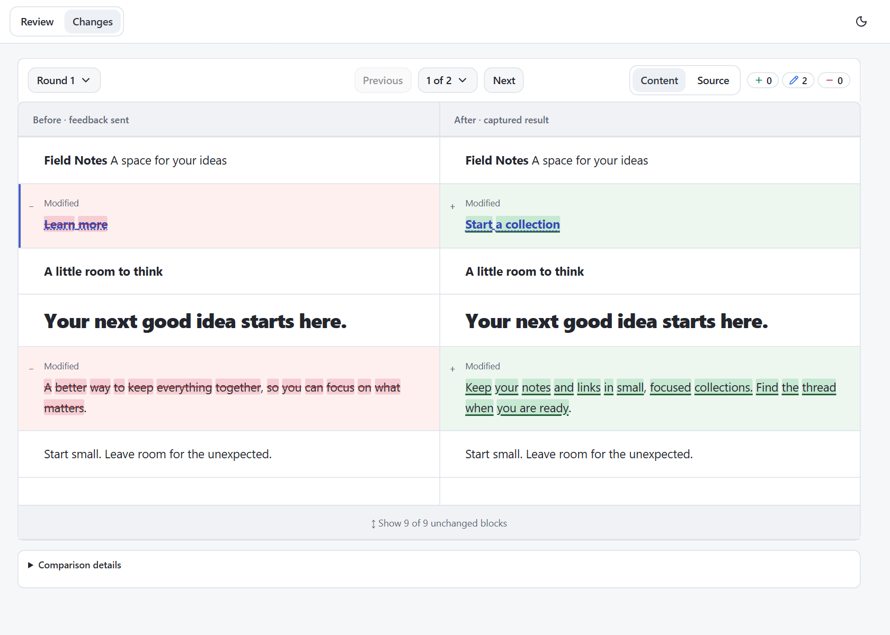

# Using Doc Review

[Back to the README](../README.md)

Open files or localhost pages in the browser, leave contextual feedback, and let
your coding agent apply it. This guide covers the details behind the
[basic review loop](../README.md#from-feedback-to-the-next-version).

## Setup and activation

Use Node.js **24.21.0 or newer**. Install personal skill instructions with:

```sh
npx -y @erdemtuna/doc-review setup --global
```

For project guidance, run `npx -y @erdemtuna/doc-review setup` from the project.
You can also ask your coding agent:

```text
Install the /doc-review skill globally from https://github.com/erdemtuna/doc-review
```

Start a fresh agent session after setup, or reload its skills. In Copilot CLI,
use `/skills reload`. Setup copies the template from the package you execute;
running an older package can restore older instructions.

Explicitly invoke `/doc-review` or ask for an interactive browser review.
Writing or updating a document, or asking for a general review, does not
automatically open the browser. Once started, the review continues until you
end it or switch tasks.

To open a target directly from the terminal:

```sh
npx -y @erdemtuna/doc-review path/to/file.html
npx -y @erdemtuna/doc-review http://localhost:3000
```

The CLI opens the review; an agent still needs to poll and apply the feedback.
The installed [skill instructions](../src/SKILL.md) describe that workflow.

## Comments and editing

Reviews start in **Review**, with **View** selected. Use page controls normally,
or switch to **Edit** to change content. Comments are available in both modes.

Select text, or hover or focus an element, then use its nearby comment icon.
The composer stays beside its target on desktop and moves to a scrolling edge
when necessary. **Back to selection** reveals an offscreen target without
changing the draft. Narrow screens use a full width composer.

| Action | Control |
| --- | --- |
| Comment on the current selection | `Ctrl+Alt+M`, or `Cmd+Option+M` on macOS |
| Submit a comment or save a comment edit | `Enter` |
| Add a line inside a comment | `Shift+Enter` |
| Cancel a comment edit | `Escape` or **Cancel** |
| Find a comment's target | **Jump to** in the Comments drawer |
| Delete a comment | **More**, then confirm deletion |

Submitting a comment adds its highlight and count without opening its card.
Activate the highlight or choose **Jump to** to see it. Existing comments have
explicit **Save** and **Cancel** controls; moving focus never saves a draft.
Closing a card only hides it. Drafts and caret position follow the comment
between the document and drawer.

In Edit you can change text and basic formatting, make lists, add links,
resize or move images, rearrange blocks, and remove elements. Type `- ` or `1. `
to start a list; use Tab and Shift+Tab to change nesting. On macOS, `Cmd+K`
adds or edits a link, and `Cmd+Shift+8` / `Cmd+Shift+7` creates lists.
Pasted images are saved beside file reviews or staged for the agent in localhost
reviews. Command clicking links lets you review multiple pages in one session.

Open **Comments** for the feedback inventory, overall note, and **Send to agent**.
The inventory scrolls independently of the note and Send controls.

## Files, scripts, and local apps

| Target | Save behavior |
| --- | --- |
| Plain HTML, including ordinary JSON data blocks and escaped code examples | Direct autosave and Revert |
| HTML containing executable scripts or event handlers | Feedback for the agent to apply to source |
| Markdown | Rendered for review; the agent updates Markdown source |
| Localhost | The agent updates the corresponding app source |

Self contained HTML runs inline scripts and event handlers automatically.
There is no approval switch to renew after source updates. Scripted previews
are never written back as replacement source, even with scripts disabled.
The renderer checks save behavior again when the source changes.

Use **More > Reload without scripts** to recover from a broken scripted page.
**Use page interactions** restores normal behavior. This temporary preference
applies to that page in the current session and takes effect when its frame is
replaced. Reload handling preserves comment drafts and reports source conflicts.

Separate script files, application imports, workers, and embedded applications
are outside the self contained file mode. Use localhost for app workflows.
Localhost pages are fetched and rewritten by the review server, so their
original cookies, storage, and requests that depend on origin may behave
differently. This is not an identical browser session in the original app.

Files use an opaque iframe origin and relative assets stay scoped to the file.
Localhost reviews retain their artifact origin, popup, and download behavior.
The shell authenticates API calls and checks frame identity, but authored scripts
share the document with the SDK: correlated feedback is not proof of human
authorship.

## Sending feedback

Send waits for edit persistence and writable HTML saves, then attempts a short
baseline capture for comparisons. Missing comparison data does not block
delivery. Save or delivery failures are reported without discarding feedback.

The agent receives one batch covering the visited pages. It polls using the
same target that opened the review:

```sh
npx -y @erdemtuna/doc-review poll path/to/file.html --timeout 600
```

After applying the feedback, it acknowledges the exact returned `batch_id`:

```sh
npx -y @erdemtuna/doc-review poll path/to/file.html --ack b_0123456789abcdef --timeout 600
```

The ID above is an example, not an ID to reuse. Each response's `next_step`
contains the actual acknowledgement command. A stale or repeated receipt never
clears newer feedback. Handled comments leave the active inventory but remain
in their round archive. New comments and corrections stay active.

Without `--timeout`, polling stops after 12 hours. An explicit timeout includes
server discovery, reconnection, and retry delays. Recoverable connection drops
are retried; authorization errors, invalid responses, and incompatible servers
fail visibly. A timeout does not discard feedback. Check immediately with:

```sh
npx -y @erdemtuna/doc-review status path/to/file.html
```

Restart polling if the review is still wanted. Stop when the review is closed.
Ending a review preserves unsent feedback for the next review of that target.

Each edit text or HTML field is limited to **200,000 Unicode code points**.
Oversized fields are identified by `truncated: true` and `truncated_fields`.
An agent must obtain the complete edit from an authoritative source, or ask you
for it, rather than treating partial content as a complete replacement.

## Review rounds and Changes

**Review** keeps the document interactive. **Changes** shows a selected round,
normally comparing content captured when feedback was sent with the result
captured after the agent acknowledged that batch. Previous rounds keep their
own fixed endpoints instead of changing on each reload.



*The same example after its feedback was applied and acknowledged.*

Content presents an aligned before and after reading surface with expandable
context. Source presents source hunks with line numbers for file reviews.
Narrow screens use a unified view with before and after attribution.
Deleted passages remain readable, and uncertain matches do not claim an exact
current target.

Comparisons cover captured text, structure, formatting, links, and image
references. They do not prove who made a change or whether every comment was
resolved. Image bytes changed at the same URL, canvas pixels, external stylesheet
appearance, inaccessible embedded content, and hidden application states are
outside the comparison guarantee. History requires no extension, screenshots,
or automatic Git commits.

Content results can wait for the original identifiable tab or panel. Return to
that view to retry; Doc Review does not click through tabs automatically.
Unknown views are labelled unverified. Source comparison covers the file
independently and can be available while Content is pending.

Source results are captured independently of the browser after acknowledgement.
Content is captured when the appropriate page is ready. Their timestamps can
differ, and neither claims to be the exact instant of acknowledgement.
Background capture retries transient failures without disabling interaction.
A page that keeps changing may never produce a stable snapshot. Use contextual
retry actions or, optionally, finish with available snapshots in comparison
details. Missing or failed capture is never presented as zero changes.

### Storage and limits

Snapshots live in `~/.doc-review`. They can contain document content, so treat
this directory as private. Comment geometry is temporary local presentation
data, not persisted feedback or data sent to the agent.

The latest five completed rounds are retained automatically. Active rounds,
pending captures, and unsent feedback protect their referenced revisions.
Unreferenced snapshots are collected at startup and periodically, with a one
hour grace period. History cannot reconstruct documents from older receipts
that had no snapshots.

| Default capture limit | Value |
| --- | --- |
| File source | 8 MiB |
| Normalized content | 4 MiB |
| Semantic blocks | 2,000 |
| Total text | 1,000,000 characters |
| Text in one block | 100,000 characters |

Comparisons have independent size, token, and edit work limits, including
1,000,000 characters and a 250 ms processing budget. A stored snapshot can exceed
comparison limits. These cases are reported as limitations, not complete
comparisons or zero changes.

## Upgrading and troubleshooting

This version requires Node **24.21.0 or newer**; Node 20, Node 22, and earlier
Node 24 patches are not supported by the compiled runtime.

The current CLI requires server protocol **17**. End active reviews and stop the
specific old server, or let it exit when idle, before restarting. Older servers
are not silently reused or forcibly replaced. Keep `.doc-review`: pending
batches and exact receipt IDs survive a controlled restart.

After updating the package, rerun its `setup --global` and project `setup`
commands, then reload skills or start a fresh agent session. Updating the CLI
without the instructions is not a complete upgrade.

Setup owns a marked section of project `AGENTS.md`. It migrates known generated
blocks but preserves custom guidance with a migration message. Correct invalid
or duplicate markers before running setup again. Review custom instructions
yourself if they still request automatic activation.

This fork uses `doc-review`, `/doc-review`, and `~/.doc-review`. It does not
install a `human-review` alias or migrate upstream state and skill files.
The retired `/trust` API returns 410 and old decision files are unused.

External source writes refresh the rendered baseline without clearing unsent
feedback, but do not automatically resolve conflicts. If saving reports a
conflict, review the changed source and use the offered reload action. Do not
bypass the required frame identity and source hash on save or revert requests.
