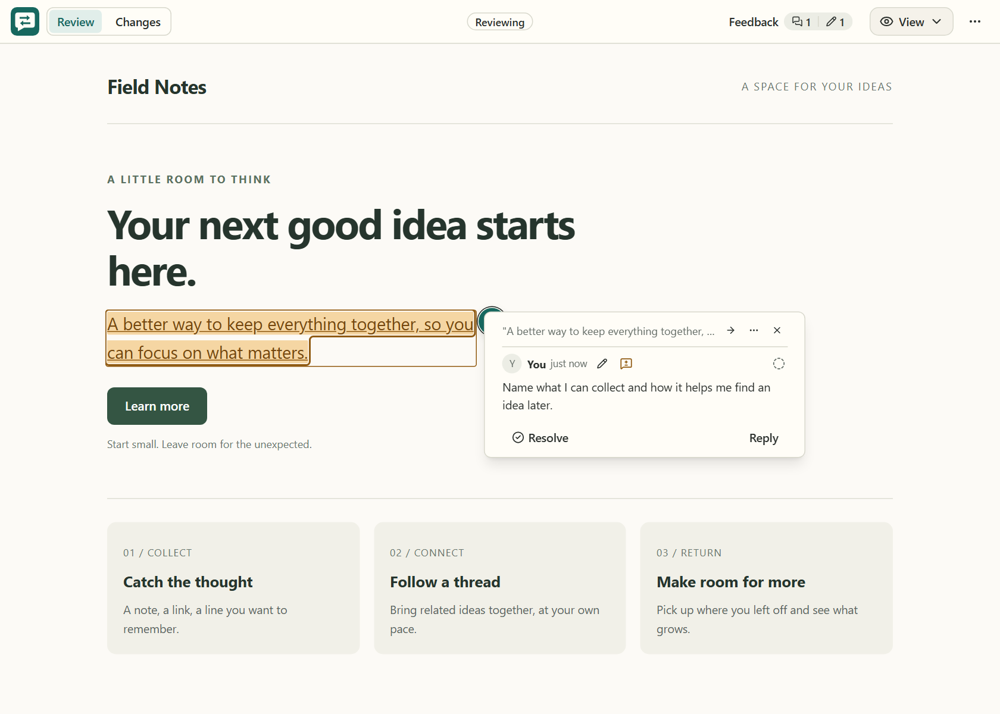
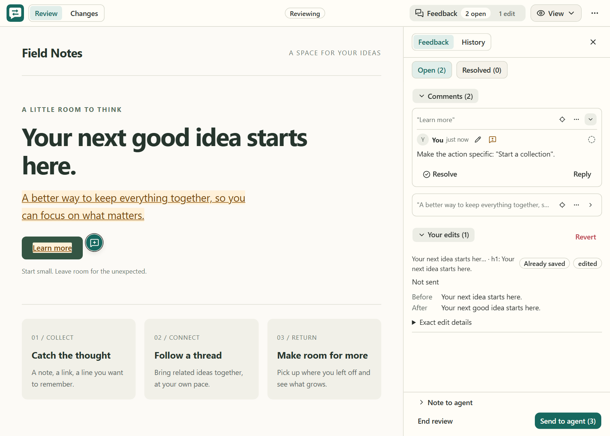
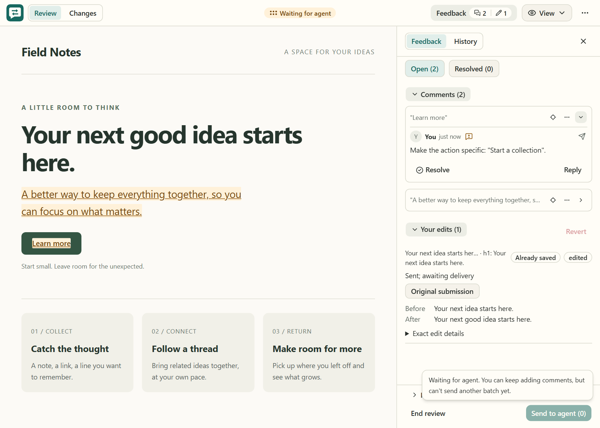
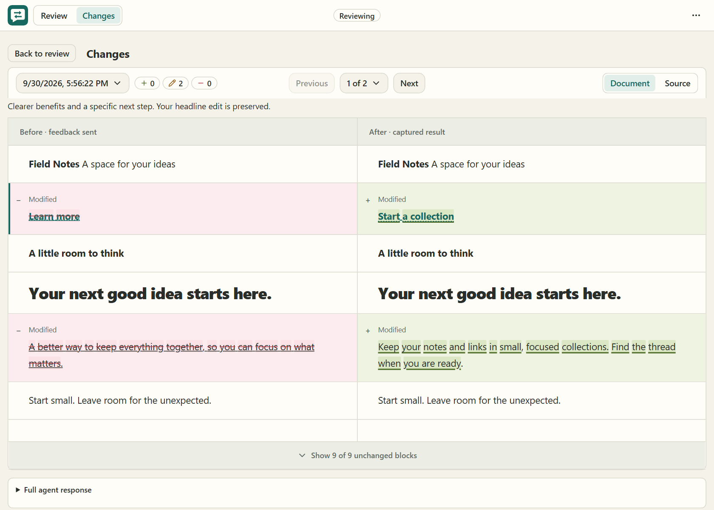

# Using Doc Review

[Back to the README](../README.md)

Open files or localhost pages in the browser, leave contextual feedback, and let
your coding agent apply it. This guide covers the details behind the
[basic review loop](../README.md#from-feedback-to-the-next-version).

## Setup and activation

Use Node.js **24.21.0 or newer**. Install personal skill instructions with:

```sh
npx -y @erdemtuna/doc-review setup --global
```

For project guidance, run `npx -y @erdemtuna/doc-review setup` from the project.
You can also ask your coding agent:

```text
Install the /doc-review skill globally from https://github.com/erdemtuna/doc-review
```

Start a fresh agent session after setup, or reload its skills. In Copilot CLI,
use `/skills reload`. Setup copies the template from the package you execute;
running an older package can restore older instructions.

Explicitly invoke `/doc-review` or ask for an interactive browser review.
Writing or updating a document, or asking for a general review, does not
automatically open the browser. Once started, the review continues until you
end it or switch tasks.

To open a target directly from the terminal:

```sh
npx -y @erdemtuna/doc-review path/to/file.html
npx -y @erdemtuna/doc-review http://localhost:3000
```

The CLI opens the review and prints its durable identity and generated commands;
an agent still needs to poll and respond to the feedback.
The installed [skill instructions](../src/SKILL.md) describe that workflow.

## Comments and editing

Reviews start with **View** selected. Use page controls normally,
or switch to **Edit** to change content. Comments are available in both modes.
In Edit, annotated text uses an outline rather than review-colored text and fill,
so native typing and formatting cannot copy the review colors into your source.
Your document's own colors, backgrounds and formatting are preserved.
Conversation messages and result notes render Markdown paragraphs, emphasis,
lists, tables and code. HTML source examples stay visible as inert code rather
than becoming executable markup; embedded images are shown by their alternative
text, not fetched. Editing a message retains its original Markdown source.

If a source save is rejected, its notice distinguishes changed source, unavailable
write access, unrecorded changes and unsafe content when the server can identify
the cause. Rejected page changes are not saved by that request. Inspect them
before reloading; keeping conversation drafts does not mean rejected HTML is on disk.

Select text, or hover or focus an element, then use its nearby comment icon.
New comments use measured space beside, above or below the selection or element
without resizing the document or covering the target. The toolbar's **Feedback**
opens the same unsaved editor in the panel. Only unavailable geometry or insufficient
target-safe space uses Feedback instead; narrow PC windows are not an automatic
fallback. Offscreen composition is pinned to the target's
clipping edge and offers **Back to selection**. An editor's X or Escape closes
empty/unchanged work immediately; meaningful unsaved text or a saved message's
changed permission prompts **Keep editing / Discard**. Keep editing restores
your caret. Save or discard dirty work before switching its target.
Feedback's outer X only hides the panel and preserves drafts.

For saved conversations, **Show in document** (with a location icon) reveals the exact passage.
Feedback stays open when the passage can remain visible; a floating panel hides when
it would cover the target. **Focus**, in Conversation actions, gives one conversation a larger transcript with its
header and composer reachable. Activate an existing highlight with a click,
Enter or Space to open one conversation beside it. A shared-target count and
chooser expose other conversations at that highlight. **Beside target**,
**Focus** and **Open in Feedback** move the same mounted editor, preserving text,
selection, caret, composition, loaded exchanges and reading position.
Sidebar headers group source and state before Locate, More and Collapse.
Adjacent popups instead offer Open in Feedback, More and Close. Popup Close only
hides the conversation; Collapse is in More. Focus has a visible **Back to Feedback**
action above the conversation. Returning reveals the original card without changing your filters;
an excluded card has a dismissible explanation. Edit sits beside each eligible
message's timestamp. Informational icons explain unsent messages, change requests,
resolution and agent outcomes on hover or keyboard focus.
Labelled Resolve/Reopen sits opposite Reply below the conversation; it remains
available in More when collapsed or a draft is open, with the same safety guards.

The card never covers its highlighted target. Short discussions fit their contents;
long transcripts scroll with Reply or the active editor kept reachable. No host
reserves a gutter for a local card. Local cards may cover
unselected prose. If no usable target-safe placement fits, the conversation stays
accessible in focused Feedback with an explanation and its editor still reachable. Narrow
Feedback floats over part of the document without changing its width; the rest of
the document remains interactive. Reopening Feedback restores the sidebar reading position and drafts.
An offscreen target offers **Show in document**, not a missing-target warning.
Missing, ambiguous, hidden and unavailable targets have an explanation and no
false jump. Original anchors and conversations are retained; there is no
reattachment control. A recovered target does not reopen a card automatically.

| Action | Control |
| --- | --- |
| Comment on the current selection | `Ctrl+Alt+M`, or `Cmd+Option+M` on macOS |
| Queue a comment, reply or correction | `Enter` or **Add comment / Add reply / Update comment**; this does not dispatch |
| Add a line inside a message | `Shift+Enter` |
| Cancel a local draft | `Escape` or the editor's X; confirm **Discard** for unsaved changes |
| Find a thread's target, including another review page | **Show in document** |
| Return to an offscreen target | **Show in document** |
| Dismiss the conversation host | **Close conversation**, or `Escape` from its controls (not a composing editor) |
| Delete a never-submitted thread | **Conversation actions → Delete thread**, then confirm deletion |

Saving queues a message. Every new message starts with **Request a change**
unchecked. Saved change requests display a message-diff icon labelled
**Change requested** on hover and for assistive technology. Unsent messages show
a dashed-circle **Not sent** icon at the far right of the message metadata.
After submission this becomes a paper-plane **Sent** icon, then double ticks without
a circle for **Received** when the agent has picked up the message or replied.
Agent replies show their informational outcome
icon, including **Answered**; request and reported-change icons remain distinct.
Only unsent messages have Edit controls. Correct sent instructions with a new
message instead of changing immutable history. Closing Feedback or collapsing a
thread only hides content. Editing an unsent message replaces its body in place,
without appending a second editor. Each header shows a compact source excerpt
and its host-specific actions. **Resolve** and **Reopen** sit below an expanded
conversation, opposite **Reply**; collapsed cards and cards with local drafts
keep the guarded action in **Conversation actions**. Finish or close a local draft
first; unsent messages and outstanding agent work prevent
Resolve. Resolve and Reopen do not show notifications.
Review-state transitions instead appear for five seconds at the top left,
below the toolbar: **Waiting for agent**, **Agent response received. Ready to review**,
or **Review ended**. Resuming after abandonment is not labelled as agent completion.
Hover, notification focus or a hidden browser tab pauses the timer; reading the
document iframe does not. F8 moves keyboard focus to notifications.
Important warnings and recovery messages stay visible.
Resolving automatically collapses the conversation into a subdued card with a
check-circle **Resolved** informational icon. Expand it anytime to read the discussion without
reopening it. Reopen expands the conversation again. Resolution in another
tab never hides your local reply draft.
Resolving from the popup beside the document dismisses it automatically. Use
the Resolved filter to find the conversation and reopen it explicitly.
Open and Resolved are separate independent filter buttons: enable either, both,
or neither. Selected color, not checkmarks, identifies enabled filters. Only Open is enabled initially.
Resolved threads no longer highlight the document or contribute to its conversation
badges. Open threads at the same passage keep their highlights. Reopen
restores the highlight; Show in document still locates resolved discussions.
Click a document highlight or conversation badge to open its discussion; click
the same target again to dismiss it. Unsaved replies survive dismissal. Enter and
Space also toggle the discussion, including targets shared by several threads.

While adding or updating a comment, typing and selection remain available but another submission of that draft
and editor cancellation are locked through acceptance or reconciliation. Newer typing is retained.
Active IME composition never triggers a draft submission or cancellation. The overall note remains
multiline: Enter never sends or saves it independently.



*The reusable highlight-adjacent conversation includes
Feedback/Focus transfers, shared-target selection and safe placement fallback.*

In Edit you can change text and basic formatting, make lists, add links,
resize or move images, rearrange blocks, and remove elements. Type `- ` or `1. `
to start a list; use Tab and Shift+Tab to change nesting. On macOS, `Cmd+K`
adds or edits a link, and `Cmd+Shift+8` / `Cmd+Shift+7` creates lists.
Pasted images are saved beside file reviews or staged for the agent in localhost
reviews. Command clicking links lets you review multiple pages in one session.

Open **Feedback** for conversations, pending edits, submission history and the
overall note. Only the Open filter starts enabled; select Resolved to include
resolved conversations. Resolving a conversation preserves your filters. Open cards start expanded
with their latest exchange and saved pending follow-ups, while resolved cards
start collapsed. Selected filters remain
visibly selected after you move away. Separate bordered discussion cards contain
reviewer and agent messages with author, avatar and time. **Reply** is visible;
hover or focus a timestamp for its full date and time.
Composers remain plain text. Saved messages, notes and results display safe
Markdown, including lists, code, tables and links. Raw HTML and images stay inert;
source evidence remains literal.
**Conversation actions** also holds **Beside target** when available.
Expanded conversations show two recent sent exchanges and all unsent replies.
The preceding answer stays visible when preparing a follow-up.
**Show earlier replies** reads actual associated reviewer/agent exchanges without
moving your reading position. Already expanded history remains available after
refreshes. Collapse and filters are independent
and local to this tab. New activity is marked without forcing expansion or scroll.
The inventory includes all shared-review member pages, not just this tab's visits.
Send includes all saved pending comments and edits, plus the optional overall note.
Start new comments from the document's selection or contextual comment control;
use **Note to agent** for feedback that is not tied to a passage.

Feedback is a nonmodal 380px sidebar. At 1020px and wider it docks beside a document
viewport of at least 640px; at narrower PC widths it floats without resizing the
document (clamped below 380px). There is no dimming or backdrop: clicks in the document
work normally. Docking preserves the current passage and never reloads the iframe.
Close, the Feedback toolbar toggle or Escape dismisses it. The inventory
scrolls independently of the footer; End and Send remain reachable.
**Comments** and **Your edits** collapse independently.
**Note to agent** has its own disclosure. It starts
collapsed and shows **Draft** when it contains text. One click opens its editor
and independent permission. Collapse and resize keep its
text and caret; a composing note cannot be collapsed. End and Send remain available,
including note-only Send when no saved comments or edits are pending.
No disclosure saves, clears or changes a draft's permission.
The toolbar shows separate review-wide counts of **open conversations** and
**manual edits awaiting handling** in one shared capsule, with conversation and
pencil icons. Hover a value for its meaning; keyboard focus on Feedback explains
both. Touch opens the labelled panel directly. Counts are independent of filters, replies, unread
activity and the pending Send count. Sent edits remain visible until an accepted
exact-version `applied` or `already-saved` outcome. Deferred and abandoned edits
keep their reason and original-submission navigation; they are never automatically
resent or treated as undone. End preserves this inventory and the full history.
**Send to agent (N)** counts all saved pending messages,
edits and the optional note, with no extra confirmation step.
Send freezes selected message/edit versions and the note at activation. New feedback
or note typing during preparation remains unsent. If a selected item changes during
the source-save barrier, Send stops and asks you to review the selection.
During loading, failed reads or unknown
acceptance, the count is unavailable rather than zero and Send stays disabled.
Every disabled Send state has an explanation. On desktop, hover the Send area
or focus its informational wrapper; first Escape dismisses the hint without
closing Feedback. On no-hover/coarse-pointer devices, a compact neutral line
above the actions shows the reason. **Waiting for agent** uses the same wording
as the toolbar, even with a nonempty next-round note. The native Send button
remains disabled; hints never send feedback or replace reconnect/receipt recovery.
The overall note can be sent on its own. It stays in this tab when you close
Feedback, inspect a comparison, or change theme. Open message drafts are not
included until explicitly saved. Drafts are never persisted or synchronized
across tabs; closing/reloading the browser loses them. The note is submission
input, not a thread, and its permission applies only to itself.
**End review** is on the left; **Send** is on the right.

## Appearance

**Review options**, the toolbar's three-dot button, offers explicit **Light** and
**Dark** choices for the review shell and in-page annotation tools
together. It remembers the preference in this browser; it does not
change the document's own colors or saved source. The rounded teal brand tile
stays the same in both themes.

The menu also identifies the current document. For a file review, **Copy full
path** copies the original file location, including when reviewing another page
or its saved comparison. It never copies the local review-server address. URL
reviews explain that no original local file path is available. Clipboard failures
stay visible with the path available for manual copying. These utilities remain
available after the review ends.

If annotation tools cannot confirm a theme change, an explicit notice offers
**Retry theme**. This retries the latest preference without reloading the page,
changing editing mode, or discarding drafts. On initial loading, annotation
tools stay hidden until the theme is applied; after a live toggle, their last
applied appearance remains until recovery. **Reload source (discard local page edits)** remains a separate
recovery action for document/render problems, not a theme-retry mechanism.

## Files, scripts, and local apps

| Target | Save behavior |
| --- | --- |
| Plain HTML, including ordinary JSON data blocks and escaped code examples | Direct autosave and Revert |
| HTML containing executable scripts or event handlers | Feedback for the agent to apply to source |
| Markdown | Rendered for review; the agent updates Markdown source |
| Localhost | The agent updates the corresponding app source |

Self contained HTML runs inline scripts and event handlers automatically.
There is no approval switch to renew after source updates. Scripted previews
are never written back as replacement source, even with scripts disabled.
The renderer checks save behavior again when the source changes.

The toolbar no longer includes a More menu or normal script-policy toggles.
Source/render failures expose **Reload source (discard local page edits)** in
the contextual recovery row; unconfirmed theme updates expose **Retry theme**.
Reviewing, Waiting for agent and Review ended have hover/focus explanations in
the centered status badge. View/Edit is at the far right. Frame reload handling preserves
in-memory drafts and reports source conflicts; a full browser reload does not
recover unsaved drafts.
**Waiting for agent** includes a two-row, three-column dot matrix. Its slow
opacity sequence runs only while the review's outstanding work and inventory
are confirmed. Disconnection, uncertain acceptance and unverified refresh pause
it; reduced-motion preferences render static dots. Delivery and animation do
not establish agent liveness or progress.

Separate script files, application imports, workers, and embedded applications
are outside the self contained file mode. Use localhost for app workflows.
Localhost pages are fetched and rewritten by the review server, so their
original cookies, storage, and requests that depend on origin may behave
differently. This is not an identical browser session in the original app.

Files use an opaque iframe origin and relative assets stay scoped to the file.
Localhost reviews retain their artifact origin, popup, and download behavior.
The shell authenticates API calls and checks frame identity, but authored scripts
share the document with the SDK: correlated feedback is not proof of human
authorship.

## Sending feedback



*Review the submission before sending. Every message has independent discussion
or change-request intent. The overall note has its own intent, not blanket
permission across individual messages or pages.*

Send waits for edit persistence and writable HTML saves, then attempts a short
baseline capture for comparisons. Missing comparison data does not block
delivery. Save or delivery failures are reported without discarding feedback.
An incomplete comparison appears as a supporting notice after sending, not
another confirmation gate. Unknown acceptance exposes the original request ID,
**Check receipt**, and **Retry same request**. A lookup miss remains unknown.
Never repeat source edits because the response was lost.



*Waiting stays explicit beside the work. Hover or focus the Send area for its
reason; no-hover devices show a compact explanation above the actions.*

**Revert** and **End review** ask for confirmation with **Cancel** focused.
Escape cancels just that confirmation. Revert keeps comments and the overall
note. End freezes persisted unsent items read-only in that review; it neither
sends them nor transfers them to a fresh review. A source or
feedback change invalidates an open confirmation; cancel it and review the
latest state. Pending actions cannot be submitted a second time.

End applies to every tab; it does not cancel accepted source work. The ended UI
keeps observing late responses after reconnection or server restart. A fresh
open creates a different review; old links never silently follow it. Outstanding
predecessor or selected-page work blocks Send and affected Edit/Revert, but you
can still prepare discussion. **Abandon submission** remains available after
End, with a separate confirmation naming the review/submission and warning to
stop the old agent and inspect source. It stops redelivery, not external work,
and promises neither cancellation nor undo.

The agent receives one immutable submission covering the selected known pages.
Open returns `review`, `receipt`, `url`, and `handoff`. All subsequent commands
use the exact `reviewId` and `entryKey`, even after End or a server restart.
Copy the generated commands rather than reusing these placeholders:

```sh
npx -y @erdemtuna/doc-review poll --review <reviewId> --entry <entryKey> --timeout 600
npx -y @erdemtuna/doc-review context --review <reviewId> --entry <entryKey> --submission <submissionId> --thread <threadId> --limit 1
```

Poll returns `state: "work"` with `review` and a delivered `submission` manifest.
Its paged `inventory` includes canonical pages, messages and exact edits, with
scoped `handoff` commands. A message's `discuss` intent
means an answer without source edits. `request-change` permits only that message's
change, not a mandatory edit. Clarification and deferral are valid outcomes.
Context returns only earlier submitted exchanges (not the current submission or
saved-unsent replies), with message intent/body, nullable response, and lifecycle
evidence. Start with the generated `--limit 1` command and expand deliberately.
Inventory/context/history expose total/returned counts and completeness;
use `--cursor <nextCursor>` until the required inventory/evidence is complete.
Default maximum is 50 records (request limit up to 100), further bounded by bytes.

Use the actual `handoff.templateCommand` to generate a complete response file in
a submission-specific new path. Outcomes/prose start blank and invalid, not as
guessed success. Fill the file truthfully, then run its `responseCommand`:

```sh
npx -y @erdemtuna/doc-review respond --review <reviewId> --entry <entryKey> --response-file response.json --timeout 600
```

The file contains `operation: "respond"`, `reviewId`, `entryKey`, `submissionId`,
the delivered submission's `expectedVersion`, a stable caller `requestId`,
`responses`, `editOutcomes`, and one `resultNote`. Include `overallOutcome` only
when an overall note exists, as a scalar outcome string; its prose belongs in
`resultNote`. Every selected message and edit must be covered
exactly once with its exact version. See the
[complete example and allowed outcomes](../src/references/response-contract.md).
Discussion cannot be reported as Applied; saved human edits use `already-saved`
only when server evidence exists. Clarify/defer incomplete or ambiguous work.
New templates also include an authored `summary` for brief orientation. Fill it
alongside the required full `resultNote`; it does not replace that answer.
Older responses and records may omit `summary`. When present, its exact text is
preserved through persistence, history, scoped reads/exports and response replay.

Each default JSON output is at most 16 KiB UTF-8 after escaping. Large values are
explicit references, never silently shortened replacements. `content` reads
complete fields or Unicode-safe chunks with scoped continuations and hashes;
`--output-file <new-path>` exports exact evidence atomically without overwriting.
`history --before <submissionId>` recovers prior overall notes/results, and
`submission --submission <id>` recovers all exact messages, edits and outcomes.
Historical intent is not renewed permission. See
[context and recovery](../src/references/context-and-recovery.md).

Successful output is `{ok:true,receipt}` after atomic persistence. Newer unsent
items survive. Inline exchanges, result notes, and receipts remain durable.
Neither target-only polling nor acknowledgement-only completion is accepted.
One cooperating handler is assumed; there is no worker lease or guarantee of
exactly-once external filesystem edits.

On connection loss the CLI retries the identical logical response within its
deadline, never source edits. Exit 1 returns typed `{ok:false,error}`. Exit 2
returns `{state:"unknown",requestId,reason}` when acceptance is uncertain:
reuse the same file and request ID. A `receipt` lookup can show acceptance,
but `not-found` is not proof of rejection. Changing the payload under the same
identity fails rather than returning a foreign result.

Without `--timeout`, polling stops after 12 hours. An explicit timeout includes
server discovery, reconnection, and retry delays. Recoverable connection drops
are retried; authorization errors, invalid responses, and incompatible servers
fail visibly. A `state: "timeout"` result does not discard feedback or prove no accepted work
exists. Check immediately with:

```sh
npx -y @erdemtuna/doc-review status --review <reviewId> --entry <entryKey>
npx -y @erdemtuna/doc-review receipt --review <reviewId> --entry <entryKey> --request-id <requestId>
```

Status returns `source: "server"|"disk"`, validated `status`, and
`latestSubmission`. It distinguishes open/ended, queued/delivered/handled/abandoned
evidence, pending counts, and overlapping or predecessor blockers. Delivered is
not proof of a live handler. Offline status reads validated `conversation-state.json`
without starting a server or modifying files; corruption is an explicit error,
not an empty status or an old-store fallback.

Restart polling if the review is still wanted. End does not cancel work already
accepted: queued submissions still arrive, and delivered ones can finish after
End/restart. Stop on `state: "ended"` once that exact review has no outstanding
work. Abandonment is separate confirmed management, including after End: it
releases exclusion and rejects late responses, without claiming cancellation,
success, or undo. Never retry an abandoned response under a new request ID.

Each edit text or HTML field is limited to **200,000 Unicode code points**.
Oversized fields are identified by `truncated: true` and `truncated_fields`.
An agent must obtain the complete edit from an authoritative source, or ask you
for it, rather than treating partial content as a complete replacement.

## Submission history and Changes

Feedback shows the latest agent result before the discussion inventory. **View
replies** opens the exact answered conversations, including older or resolved
exchanges. **View changes** opens reported changes and their retained comparison;
mixed batches offer both. Note-only or edit-only discussions use **View response**
for the full summary without empty comparison controls. The note remains available
when a capture is pending, unavailable, or failed. **Back to review** restores the
originating workspace locally, even if a comparison request fails or is still
loading. The toolbar's **Changes** destination selects change results, not
discussion-only batches. **History** in the Feedback
header opens earlier submissions without replacing your reply or overall-note
editors. The **Feedback | History** segmented switch matches **Review | Changes**;
choose **Feedback** to return to retained text, permissions and
reading position. Completed submissions are collapsed in **History**;
expand one for its note, result, named pages and **Content changes** or
**Source changes** actions. History is a newest-first vertical timeline with labeled,
color-coded status icons. Waiting submissions have a visible **Abandon** button, even
when collapsed; it opens a confirmation explaining that external work may continue.
History has no overflow menu, CLI commands, raw submission identifiers, receipt JSON
or technical disclosures. Ending the review does not abandon accepted work.

A temporary connection loss shows one **Reconnect** action. If the same server
session is still available, reconnecting preserves the live document, native
inputs, and comment drafts instead of reloading. Changed source is flagged for
inspection before reload; a restarted server still uses guarded reattachment.
Server connectivity does not mean an agent is actively listening.

Content-capture problems appear with the affected result/page, not as an unrelated
source-save warning. Automatic and explicit captures share one exact in-flight
request. An immutable conflict is reconciled only when that same result's Content
comparison is authoritatively available; Source alone is not proof. Changed source,
changed visible view and genuine capture failures remain explicit.

The document stays mounted and retains unsent drafts while Changes is open. A comparison
normally compares content captured when feedback was sent with the result
captured after the agent reported source changes in a complete response. Previous submissions keep their
own fixed endpoints instead of changing on each reload.
The version selector and edit counts sit on the left, Previous/Next stays
centered, and Document/Source sits on the right. This control strip stays visible
below the Changes heading as you scroll through the comparison.
An authored summary appears above the diff; older results use a deterministic
heading. The full agent response, submitted feedback, reviewer edit evidence and
comparison diagnostics remain in separate disclosures below the diff.
Comparisons show observed changes, not proof that every request was resolved.



*The same example after its feedback was applied and answered.*

Content presents an aligned before and after reading surface with expandable
context. Source presents source hunks with line numbers for file reviews.
Narrow screens use a unified view with before and after attribution.
Deleted passages remain readable, and uncertain matches do not claim an exact
current target.

Comparisons cover captured text, structure, formatting, links, and image
references. They do not prove who made a change or whether every comment was
resolved. Image bytes changed at the same URL, canvas pixels, external stylesheet
appearance, inaccessible embedded content, and hidden application states are
outside the comparison guarantee. History requires no extension, screenshots,
or automatic Git commits.

Content results can wait for the original identifiable tab or panel. Return to
that view to retry; Doc Review does not click through tabs automatically.
Unknown views are labelled unverified. Source comparison covers the file
independently and can be available while Content is pending.

Source results are captured independently of the browser after a changes-reported response.
Content is captured when the appropriate page is ready. Their timestamps can
differ, and neither claims to be the exact instant of response acceptance.
Reply-only results do not fabricate a version, capture, or reload. A result note
can still be titled "What changed" for an already-saved human edit.
Reloading the source can retry unavailable rendered capture without erasing a response.
A page that keeps changing may never produce a stable snapshot. Use the
submission's **Capture current content** action when available on the open page.
If you opened Changes before that capture finished, **Refresh comparison** reads
the saved evidence again without recapturing it; a failed comparison read has a
separate **Retry comparison** action. Missing or failed capture is
never presented as zero changes, and does not undo a handled response.

**Your edits** shows readable Before/After previews and **Already saved** or
**Source pending** evidence. All pending edits are included in Send.
**Exact edit details** retains the complete recorded content and source identity.
The result note separates edits you saved before Send from agent-reported work;
deferred edits do not imply that source was changed. Long latest-result summaries
expand in place with **Read more / Show less**. **Replies (N)** discloses section
labels and comment excerpts; choosing a row opens its exact exchange. The reader
keeps **Feedback | History** visible, with **Previous/Next** and **Back to replies**.
Back restores the originating result's expanded list, scroll position and keyboard
focus in Feedback or History without discarding reply drafts. No result preview, edit disclosure, or comparison
navigation saves an unsent draft.

### Storage and limits

Snapshots live in `~/.doc-review`. They can contain document content, so treat
this directory as private. Comment geometry is temporary local presentation
data, not persisted feedback or data sent to the agent.

Referenced conversations, results, receipts, history, revisions and staged assets
are retained indefinitely, not limited to five rounds or 30 days.
Unreferenced snapshots are collected at startup and periodically, with a one
hour grace period. History cannot reconstruct documents from older receipts
that had no snapshots.

| Default capture limit | Value |
| --- | --- |
| File source | 8 MiB |
| Normalized content | 4 MiB |
| Semantic blocks | 2,000 |
| Total text | 1,000,000 characters |
| Text in one block | 100,000 characters |

Comparisons have independent size, token, and edit work limits, including
1,000,000 characters and a 250 ms processing budget. A stored snapshot can exceed
comparison limits. These cases are reported as limitations, not complete
comparisons or zero changes.

## Upgrading and troubleshooting

This version requires Node **24.21.0 or newer**; Node 20, Node 22, and earlier
Node 24 patches are not supported by the compiled runtime.

The current CLI requires server protocol **25**. End active reviews and stop the
specific old server, or let it exit when idle, before restarting. Older servers
are not silently reused or forcibly replaced. Keep `.doc-review`: pending
accepted submissions and exact receipt IDs survive a controlled restart.
The new store is `conversation-state.json`; old `state.json`, history, and pasted
assets are left untouched, with no importer, migration switch, or destructive reset.

After updating the package, rerun its `setup --global` and project `setup`
commands, then reload skills or start a fresh agent session. Updating the CLI
without the instructions is not a complete upgrade.

Setup owns a marked section of project `AGENTS.md`. It migrates known generated
blocks but preserves custom guidance with a migration message. Correct invalid
or duplicate markers before running setup again. Review custom instructions
yourself if they still request automatic activation.

This fork uses `doc-review`, `/doc-review`, and `~/.doc-review`. It does not
install a `human-review` alias or migrate upstream state and skill files.
The retired `/trust` API returns 410 and old decision files are unused.

External source writes refresh the rendered baseline without clearing unsent
feedback, but do not automatically resolve conflicts. If saving reports a
conflict, review the changed source and use the offered reload action. Do not
bypass the required frame identity and source hash on save or revert requests.
